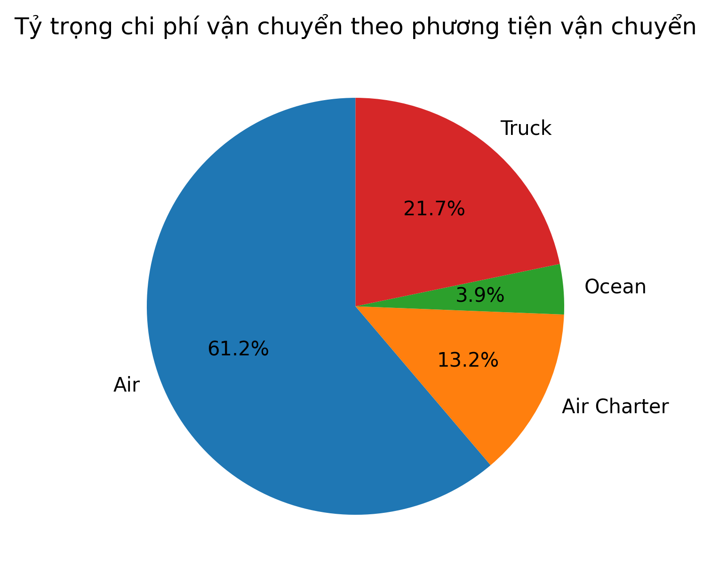
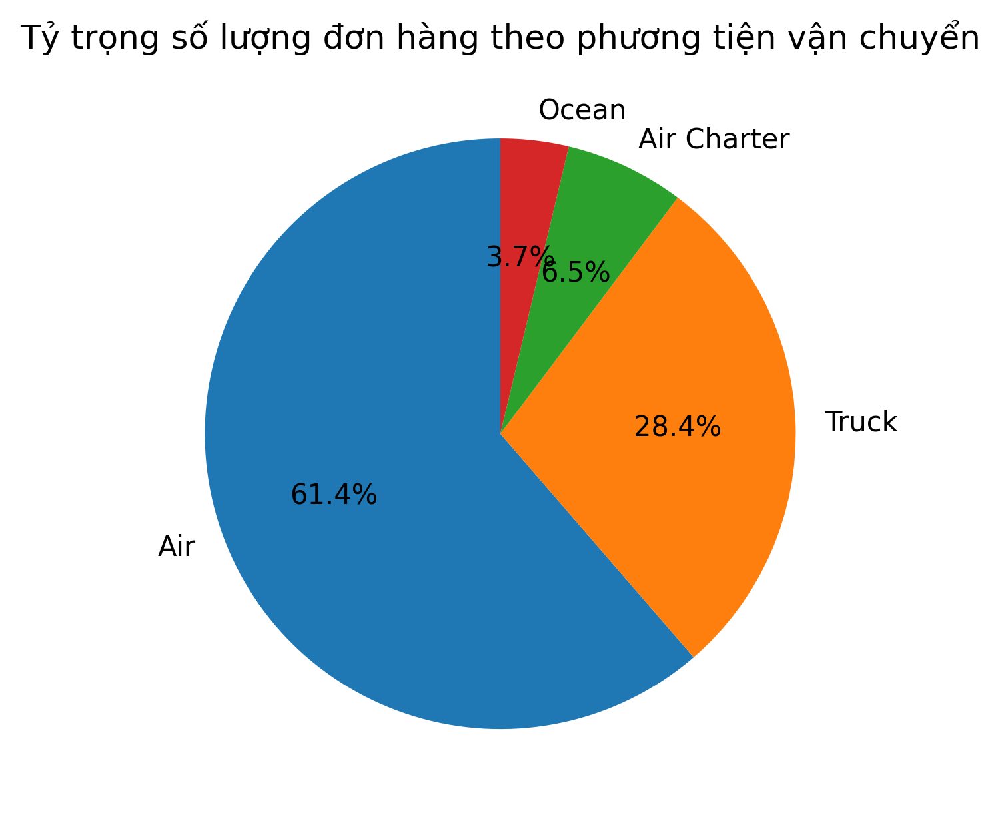
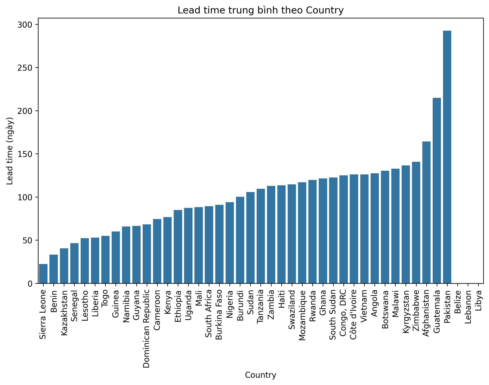
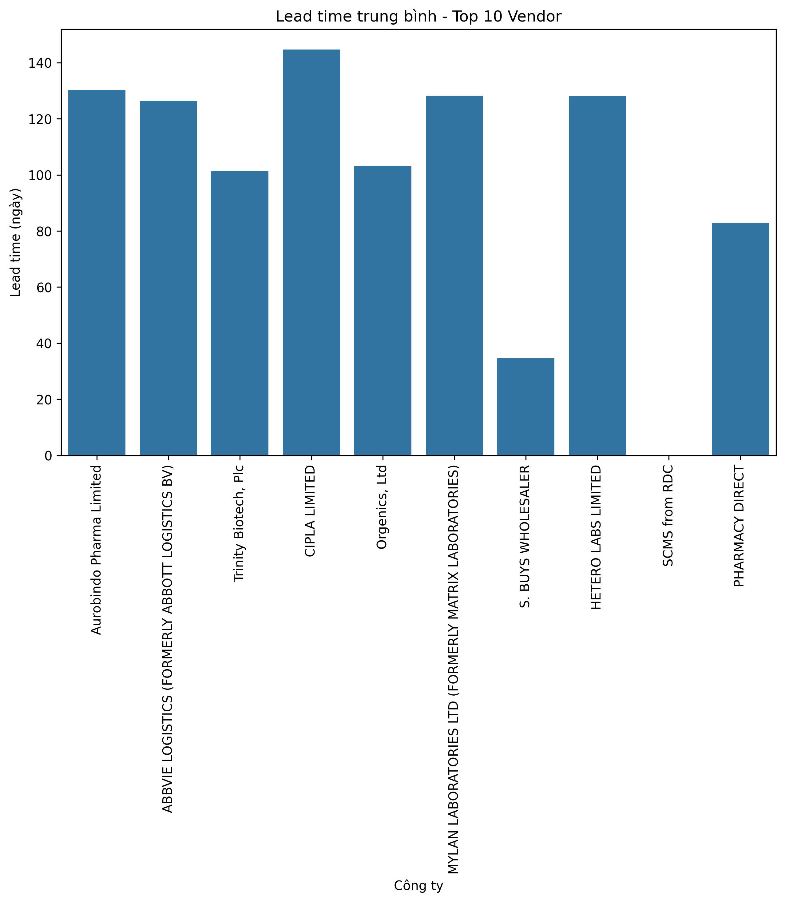
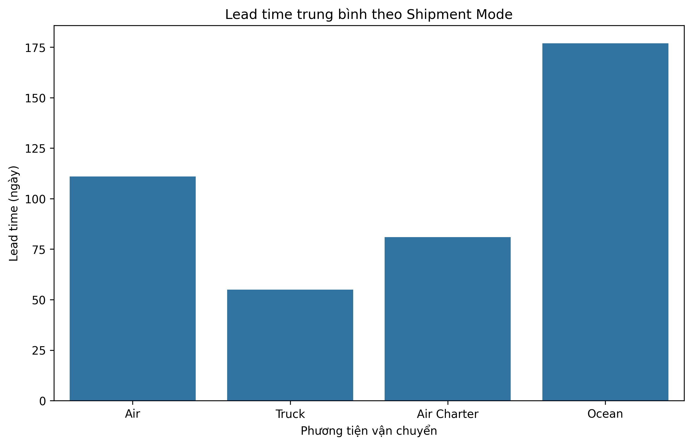
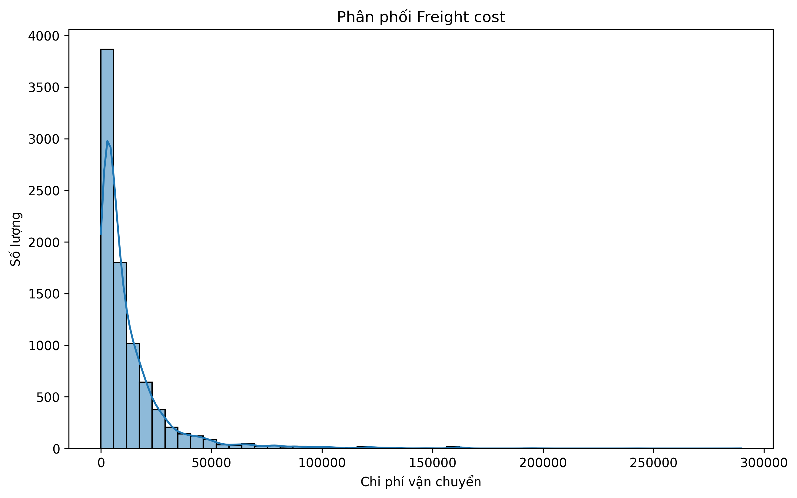
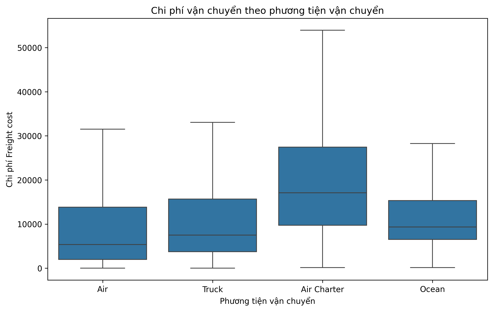
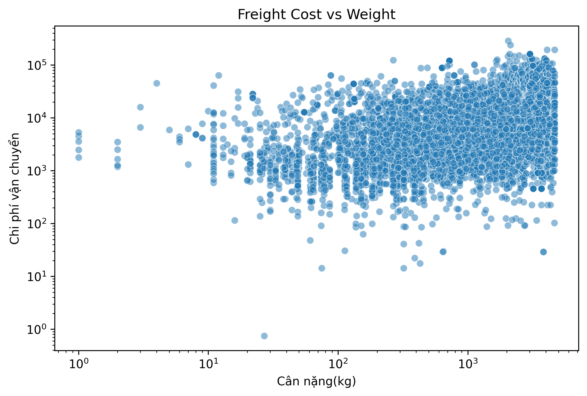

# Supply Chain Performance & Freight Cost Analysis

This repository contains an exploratory analysis of the **SCMS Delivery History Dataset**, focusing on shipment modes, lead times, on-time delivery, and freight cost efficiency.

## Executive Summary
Key insights:
- **Air freight dominates** shipments (>60%) and costs, showing strong reliance on speed but at a premium.
- **Air freight dominates** shipments (>60%) and costs, showing strong reliance on speed but at a premium.
- **Trucking is cost-efficient**, carrying ~30% of orders while contributing only 22% of costs.
- **Air Charter is expensive**, handling just 6.5% of shipments but 13% of costs, mostly for urgent cases.
- **On-time delivery varies by region and vendor**, with several areas showing frequent delays.
- **Freight cost per kilogram differs significantly by shipment mode and region**, pointing to optimization opportunities.

These findings highlight the trade-offs between speed, cost, and reliability in logistics operations.

## Repository Structure

## Data

- Source: SCMS **Delivery** History Dataset (link to original dataset [here](https://www.kaggle.com/datasets/apoorvwatsky/supply-chain-shipment-pricing-data)).  

- Large files are not committed to this repository.  

- Please place the dataset under `data/` before running the notebook.
---

## Key Analyses & Visuals

### 1. Shipment Mode – Volume & Cost Share

**Shipment volume by transportation mode**

- Air accounts for over 60% of shipments, underlining its role as the primary mode.

- Trucking follows with ~28%, essential for domestic and last-mile delivery.

- Ocean freight remains limited at 3.7%, typically used for bulk or oversized cargo.

**Freight cost share by transportation mode**

- Air also leads in cost (>60%), consistent with its volume share and high unit price.

- Trucking, with nearly 30% of orders, makes up only 21.7% of costs, proving its cost efficiency.

- Air Charter drives 13% of costs with just 6.5% of shipments, showing its premium use in urgent situations.

- Ocean freight costs remain small (~4%), in line with its limited usage.

---

### 2. Lead Time Analysis
**By country**

- Lead times vary widely. Sierra Leone, Benin, and Kazakhstan average under 50 days, while Pakistan and Guatemala reach 200–300 days.

- Differences likely reflect infrastructure quality, customs processes, and distance.

**By top 10 vendors**

- Vendors differ significantly. S. Buys Wholesaler averages ~35 days, while CIPLA Limited exceeds 140 days.

- Others, such as Pharmacy Direct and Orgenics Ltd, cluster between 85–100 days.

**By shipment mode**

- Ocean: ~175 days, the slowest.

- Air: ~110 days.

- Air Charter: ~80 days, faster than air but still moderate.

- Truck: ~55 days, the quickest, ideal for short-distance or domestic routes.

---
### 3. On-time Delivery

The on-time rate shows consistent room for improvement.

Trucking achieves relatively higher reliability than air and ocean.

Certain vendors and regions report frequent delays, suggesting weak points in planning or execution.

Improvements in scheduling and coordination could raise overall service levels.

---
### 4. Freight Cost per Kilogram
Costs differ sharply across modes:

*   Air and Air Charter are most expensive per kg.
*   Trucking is the lowest-cost option.
*   Ocean lies in the middle, suited for heavy but less urgent cargo.

---

## Conclusion & Recommendations

This analysis confirms clear trade-offs between **volume, cost, and timeliness**:  

- **Air freight** ensures speed but comes with high costs → best for critical shipments.  

- **Trucking** is cost-efficient → maximize for domestic/non-urgent deliveries.  

- **Air Charter** is disproportionately expensive → keep for emergencies only.  

- **Ocean freight** could be expanded for bulk, low-priority orders.
  
**Recommendations:**  

1. Rebalance orders between **Air and Truck** to reduce costs.  

2. Improve **on-time performance** with stronger vendor coordination.  

3. Investigate **regional bottlenecks** behind delays.  

4. Increase **use of Ocean freight** where possible.  

---

## 👤 Author
Trinh Nguyen
ng.trinh3023@gmail.com

